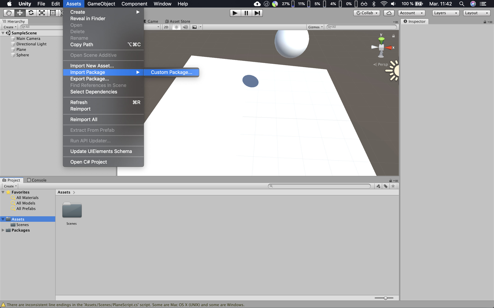
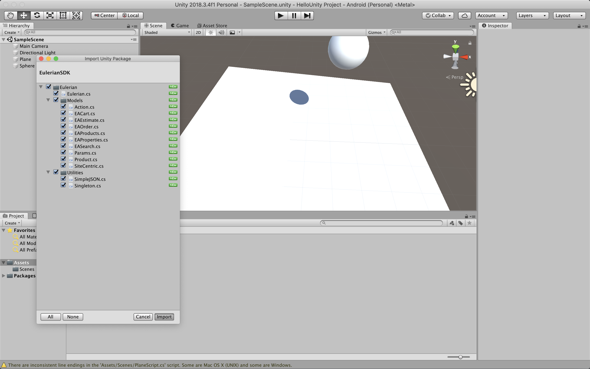
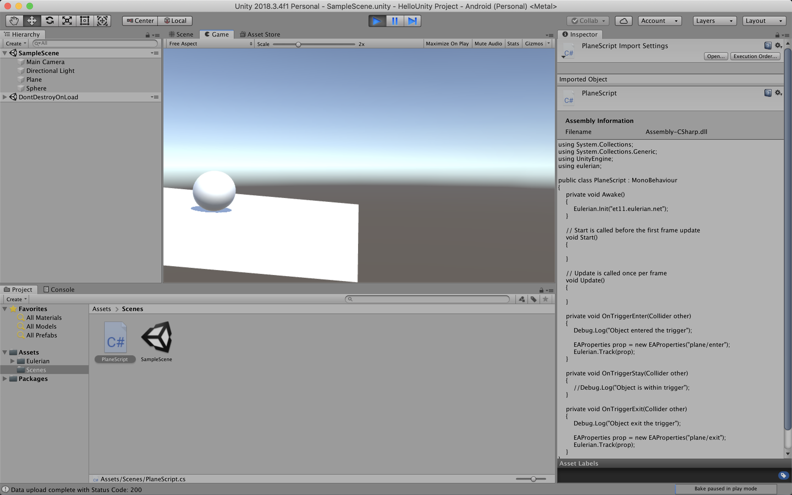

# Unity SDK for Eulerian Analytics

## Installation

1. Download `EulerianSDK.unitypackage`.
2. In your Unity project, import custom package in `Assets/`.



3. Keep all files checked and click "Import".



## Usage

1. Import Eulerian in your script file:

```
using eulerian;
```

2. Initialize the SDK. Consider using the Awake function from Unity's Monobehavior class as a starting place:

```
private void Awake()
{
  Eulerian.Init("your-domain");
}
```

3. Begin tracking `EAProperties`:

```
EAProperties prop = new EAProperties("plane/enter");
Eulerian.Track(prop);
```



## Building the SDK (macOS)

From the project’s root folder, run `/Applications/Unity/Unity.app/Contents/MacOS/Unity -quit -batchmode -projectPath /. -exportPackage Assets/Eulerian EulerianSDK.unitypackage -logfile Build/UnityPackageExport.log`.